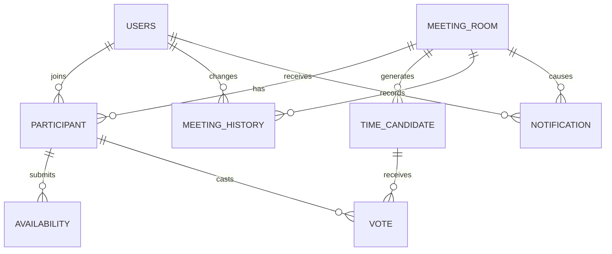

# MeetPick ERD v1 — Common Entity Contract

> Java 코드 기준은 각 `*/domain/*.java`, DB 기준은 Flyway `V1__init_schema.sql`이다.
> Entity 필드/관계 변경은 단순 개인 구현이 아니라 **공통 contract 변경**으로 취급한다.

## Entity / Owner / Java 위치

| Table | Java Entity | Owner | Cross-team 사용 |
|---|---|---|---|
| `users` | `user/domain/User.java` | A | Participant/History/Notification이 참조 |
| `meeting_room` | `meeting/domain/MeetingRoom.java` | B | C가 workflow/confirm에서 변경 |
| `participant` | `participant/domain/Participant.java` | B | A가 권한/초대에서 사용 |
| `availability` | `availability/domain/Availability.java` | B | C 추천 input |
| `time_candidate` | `recommendation/domain/TimeCandidate.java` | C | 투표/확정 input |
| `vote` | `vote/domain/Vote.java` | C | - |
| `meeting_history` | `history/domain/MeetingHistory.java` | C | B 상태 변경도 기록 대상 |
| `notification` | `notification/domain/Notification.java` | C | 사용자 화면에 노출 |

## 핵심 컬럼

| Table | 핵심 컬럼 |
|---|---|
| `users` | id, email, password, nickname, created_at, updated_at |
| `meeting_room` | id, title, candidate_start/end_at, duration_minutes, availability_deadline_at, status, confirmed_start/end_at |
| `participant` | id, meeting_room_id, user_id, role, joined_at |
| `availability` | id, participant_id, start_at, end_at, priority |
| `time_candidate` | id, meeting_room_id, start/end_at, available_count, preference_score, candidate_rank |
| `vote` | id, candidate_id, participant_id |
| `meeting_history` | id, meeting_room_id, changed_by_user_id, previous_status, new_status |
| `notification` | id, user_id, meeting_room_id, type, message, is_read, read_at |

## 공통 enum

- `MeetingStatus`: COLLECTING / VOTING / CONFIRMED / CANCELLED
- `ParticipantRole`: HOST / MEMBER
- `AvailabilityPriority`: PREFERRED / AVAILABLE / POSSIBLE
- `NotificationType`: MEETING_CONFIRMED (MVP)

## 확정사항

- `MeetingRoom.hostId` 없음. HOST는 `Participant.role = HOST`가 유일한 기준.
- `UNIQUE(users.email)`
- `UNIQUE(participant.meeting_room_id, participant.user_id)`
- `UNIQUE(vote.candidate_id, vote.participant_id)`
- Invitation/Refresh/Rate Limit 관계형 테이블 없음. Redis 담당.
- Availability는 원본 interval을 저장하고 30분 slot은 계산 시 생성.
- Meeting은 물리 삭제하지 않고 `CANCELLED` 상태 전이.
- User 탈퇴 / Participant 강퇴·퇴장은 MVP 제외.
- 애플리케이션 성능용 복합 인덱스는 B의 실제 Query + EXPLAIN ANALYZE 실험 전 추가하지 않는다. (FK/Unique 유지에 필요한 DB 인덱스는 별개.)
- DDL의 source of truth는 Flyway이며 기존 V1을 배포 후 수정하지 않고 V2 이후 migration을 추가한다.
